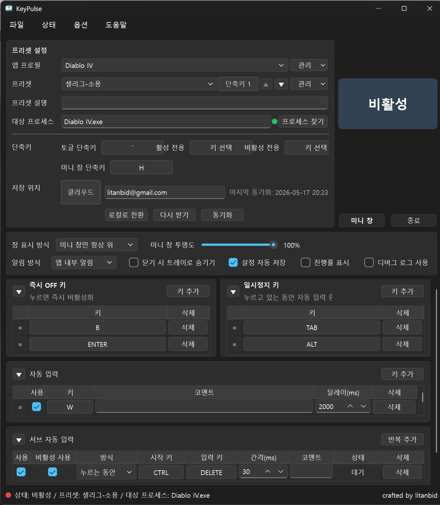

# Diablo IV 설정 예시

이 문서는 KeyPulse를 Diablo IV에서 사용할 때의 설정 예시입니다.

아래 값은 특정 사용자 환경에서 쓰는 예시이므로, 캐릭터 빌드, 게임 키 설정, 해상도, 입력 장치에 맞춰 조정해야 합니다. 게임 이용약관과 플레이 환경을 먼저 확인하고, 다른 사용자에게 피해를 주는 방식으로 사용하지 않는 것을 전제로 합니다.

## 앱 프로필

| 항목 | 예시 값 | 설명 |
| --- | --- | --- |
| 앱 프로필 | `Diablo IV` | Diablo IV용 공통 실행 설정입니다. |
| 대상 프로세스 | `Diablo IV.exe` | 이 프로세스가 활성 창일 때만 자동 입력이 동작합니다. |
| 토글 단축키 | `` ` `` | 활성/비활성을 전환합니다. |
| 미니 창 단축키 | `H` | 메인뷰와 미니 창을 전환합니다. |
| 즉시 OFF 키 | `B`, `ENTER` | 누르면 즉시 비활성화합니다. |
| 일시정지 키 | `TAB`, `ALT` | 누르고 있는 동안 자동 입력을 잠시 멈춥니다. |

## 프리셋 구성 예시

프리셋은 같은 `Diablo IV` 앱 프로필을 공유하고, 자동 입력 목록만 다르게 둡니다.

| 프리셋 | 자동 입력 예시 | 서브 자동 입력 | 메모 |
| --- | --- | --- | --- |
| `셀리그-소용` | `W 1900ms`, `E 150ms`, `R 300ms` | `CTRL`을 누르는 동안 `DELETE`를 `30ms`마다 입력 | 서브 자동 입력이 필요한 프리셋 예시입니다. |
| `악마술사` | `R 6000ms` | 없음 | 긴 간격 단일 입력 예시입니다. |
| `냉기꿰사` | `R 200ms`, `D 200ms`, `E 200ms(비활성)` | `CTRL`을 누르는 동안 `DELETE`를 `30ms`마다 입력 | 일부 키를 비활성으로 남겨두고 필요할 때 켤 수 있습니다. |
| `구상번개` | `Q 200ms`, `E 200ms`, `R 200ms`, `F 200ms(비활성)` | 없음 | 여러 스킬 키를 짧은 간격으로 처리하는 예시입니다. |

## 입력 루틴 예시

입력 루틴은 여러 단계의 `대기 -> 입력`을 한 묶음으로 실행할 때 사용합니다.

예시:

| 단계 | 동작 |
| --- | --- |
| 1 | `0ms` 대기 후 `W` 입력 |
| 2 | `20ms` 대기 후 `E` 입력 |
| 3 | `20ms` 대기 후 `R` 입력 |
| 4 | `3000ms` 대기 |

이런 구성은 특정 입력 루틴으로 묶어두고, 필요할 때 활성화해서 테스트할 때 유용합니다.

## 서브 자동 입력 예시

- 서브 자동 입력은 메인 자동 입력과 별도로, 특정 키를 누르는 동안 또는 토글한 동안 다른 키를 반복 입력하는 기능입니다.
- 인게임에서 `DELETE`키를 상호작용에 넣어두고 `컨트롤`키를 연결해서 컨트롤 누르고 있으면 자동으로 아이템을 획득합니다. 

예시:

| 항목 | 값 |
| --- | --- |
| 방식 | `누름` |
| 시작 키 | `CTRL` |
| 입력 키 | `DELETE` |
| 간격 | `30ms` |
| 비활성 허용 | 켬 |

`비활성 허용`이 켜져 있으면 KeyPulse가 비활성 상태여도 대상 프로세스가 활성 창일 때 해당 서브 자동 입력만 동작할 수 있습니다.

## 추천 사용 흐름

1. `프로세스 찾기`로 `Diablo IV.exe`가 제대로 잡히는지 확인합니다.
2. 미니 창을 켜고 게임 화면에서 방해되지 않는 위치로 옮깁니다.
3. `진행률 표시`를 켜서 각 키 입력까지 남은 시간을 확인합니다.
4. 처음에는 짧은 시간 동안 테스트한 뒤, 필요 없는 키는 `활성` 체크를 끕니다.
5. 문제가 생기면 `B` 또는 `ENTER` 같은 즉시 OFF 키로 즉시 비활성화합니다.

## 설정예시

## 주의할 점

- Diablo IV 안의 키 설정이 바뀌면 KeyPulse 프리셋도 함께 맞춰야 합니다.
- 마우스 버튼 입력은 현재 커서 위치에 발생하므로, 게임 안에서 커서 위치가 의미 있는 상태인지 확인해야 합니다.
- 너무 짧은 입력 간격은 게임 또는 시스템 입력 처리에 따라 누락될 수 있습니다.
- 디버깅이 필요하면 `디버그 로그 사용`을 켜고 `logs/keypulse.log`를 확인합니다.
